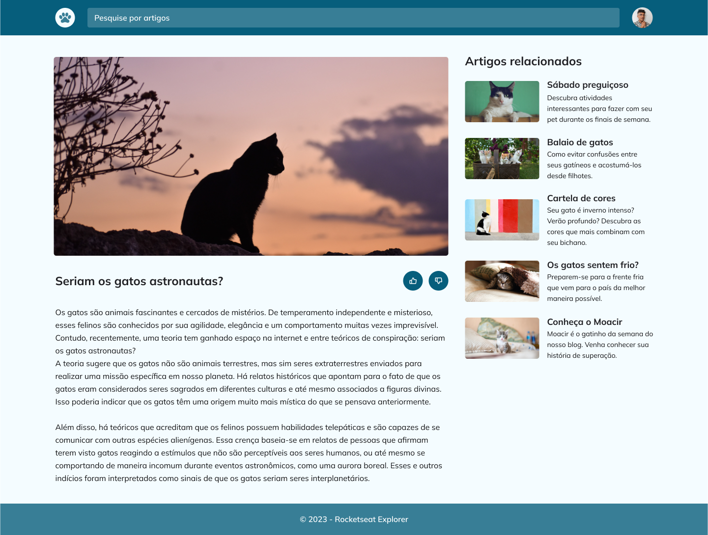

# README for Explorer Bonus Challenge 5

## Overview

This challenge is designed to help you apply the skills and techniques you've learned in class to a real-world project. Your task is to build a project following a provided Figma design. You can view the design and get a sense of the project's aesthetic and functionality here: [Figma Design](https://www.figma.com/community/file/1256354927622258124).

### Challenge Objectives

While building the UI for this project, remember to incorporate the following key aspects:

1. **Mobile First:** Start by making your project responsive on smaller screens, then adjust it for desktop versions.
2. **Flexible Measurement Units:** Use units that allow for more fluidity and adaptability across different screen sizes.
3. **Grid:** Implement a grid layout to organize your content effectively.
4. **CSS Variables:** Utilize variables in CSS for more maintainable and readable code.
5. **HSL Colors:** Make use of HSL color values for better control over color styling.
6. **Simple Animations and Transitions:** Add animations and transitions to enhance the user experience.
7. **Grid Template Areas:** Employ grid template areas for a more structured layout approach.

## Project Preview

Below is a preview of the project:



## Project Structure

The project is structured as follows:

- `index.html`: This is the main HTML file where the structure of your webpage will be defined.
- `style.css`: This file contains all the styling for your webpage, including layout, colors, and fonts.
- `assets/`: This folder should contain all the images and other assets used in your project.

## Cloning the Repository

To get started with this project, you will need to clone the repository. Use the following command in your terminal:

```
git clone https://github.com/giovannivicentin/explorer-bonus-challange-5
```

This will create a local copy of the project on your machine, allowing you to start working on it immediately.
